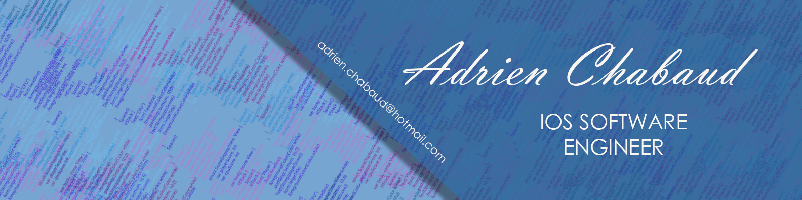

# 💫 Adrien CHABAUD  

I'm Adrien from France, currently living in Scotland and I do iOS development and UI/UX Design. I really enjoy learning languages, wireframing and UI/UX. 

Ex-intern @ HighConnexion, Aix-en-Provence

## Skills and Experience
* 📱Swift
* 💻 Xcode
* 👨‍💻 Figma

# 📊 GitHub Stats:

 

  

## 🏆 GitHub Trophies

### ✍️ Random Dev Quote

